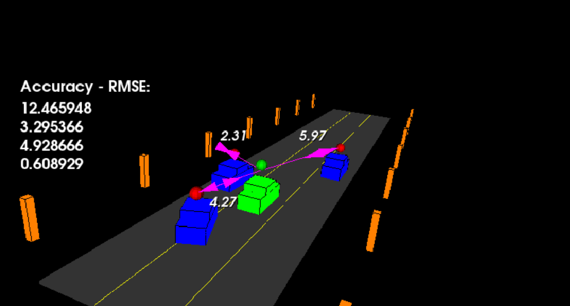

# SFND Unscented Kalman Filter
Sensor Fusion UKF Highway Project Starter Code

In this project you will implement an Unscented Kalman Filter to estimate the state of multiple cars on a highway using noisy lidar and radar measurements. Passing the project requires obtaining RMSE values that are lower that the tolerance outlined in the project rubric. 

The main program can be built and ran by doing the following from the project top directory.

1. mkdir build
2. cd build
3. cmake ..
4. make
5. ./ukf_highway

Note that the programs that need to be written to accomplish the project are src/ukf.cpp, and src/ukf.h

The program main.cpp has already been filled out, but feel free to modify it.

`main.cpp` is using `highway.h` to create a straight 3 lane highway environment with 3 traffic cars and the main ego car at the center. 
The viewer scene is centered around the ego car and the coordinate system is relative to the ego car as well. The ego car is green while the 
other traffic cars are blue. The traffic cars will be accelerating and altering their steering to change lanes. Each of the traffic car's has
it's own UKF object generated for it, and will update each indidual one during every time step. 

The red spheres above cars represent the (x,y) lidar detection and the purple lines show the radar measurements with the velocity magnitude along the detected angle. The Z axis is not taken into account for tracking, so you are only tracking along the X/Y axis.

---

## Other Important Dependencies
* cmake >= 3.5
  * All OSes: [click here for installation instructions](https://cmake.org/install/)
* make >= 4.1 (Linux, Mac), 3.81 (Windows)
  * Linux: make is installed by default on most Linux distros
  * Mac: [install Xcode command line tools to get make](https://developer.apple.com/xcode/features/)
  * Windows: [Click here for installation instructions](http://gnuwin32.sourceforge.net/packages/make.htm)
* gcc/g++ >= 5.4
  * Linux: gcc / g++ is installed by default on most Linux distros
  * Mac: same deal as make - [install Xcode command line tools](https://developer.apple.com/xcode/features/)
  * Windows: recommend using [MinGW](http://www.mingw.org/)
 * PCL 1.2

## Basic Build Instructions

1. Clone this repo.
2. Make a build directory: `mkdir build && cd build`
3. Compile: `cmake .. && make`
4. Run it: `./ukf_highway`

## Editor Settings

We've purposefully kept editor configuration files out of this repo in order to
keep it as simple and environment agnostic as possible. However, we recommend
using the following settings:

* indent using spaces
* set tab width to 2 spaces (keeps the matrices in source code aligned)

## Code Style

Please stick to [Google's C++ style guide](https://google.github.io/styleguide/cppguide.html) as much as possible.

## Generating Additional Data

This is optional!

If you'd like to generate your own radar and lidar modify the code in `highway.h` to alter the cars. Also check out `tools.cpp` to
change how measurements are taken, for instance lidar markers could be the (x,y) center of bounding boxes by scanning the PCD environment
and performing clustering. This is similar to what was done in Sensor Fusion Lidar Obstacle Detection.

## Project Instructions and [Rubric](https://review.udacity.com/#!/rubrics/2551/view)

# SFND_Unscented_Kalman_Filter
## Advance Learning Tips
- [Applying the unscented Kalman filter for nonlinear state estimation](https://www.sciencedirect.com/science/article/pii/S0959152407001655)
- [Uncented Kalman Filter for Dummies](https://robotics.stackexchange.com/questions/9233/unscented-kalman-filter-for-dummies)
- [Learning the Unscented Kalman Filter](https://www.mathworks.com/matlabcentral/fileexchange/18217-learning-the-unscented-kalman-filter?w.mathworks.com)
- [Introduction to Unscented Kalman Filter](http://homepages.inf.ed.ac.uk/rbf/CVonline/LOCAL_COPIES/AV0809/qi.pdf)
- [Unscented Kalman Filter Tutorial](https://www.cse.sc.edu/~terejanu/files/tutorialUKF.pdf)
- [KF, EKF and UKF](http://ais.informatik.uni-freiburg.de/teaching/ws12/mapping/pdf/slam05-ukf.pdf)
- [Application of Unscented Kalman Filter to a cable driven surgical robot](https://ieeexplore.ieee.org/document/6224776)

## Advance Learning Tips

Below are some resources of strategies and techniques for Debugging Lots of C++ Objects effectively.

- [Debugging Strategies, Tips, and Gotchas](https://www.cprogramming.com/debugging/debugging_strategy.html)
- [Techniques for Debugging in C++](https://accu.org/journals/overload/9/46/goodliffe_423/)
- [Some favorite debugging techniques in C++ as discussed on stack overflow](https://stackoverflow.com/questions/1325853/what-are-your-favorite-debugging-techniques-in-c)

## Code Efficiency 

Here are a few tips for improving on code efficiency and optimization:

- The most efficient types:
    - When defining an object to store an integer number, use the int or the unsigned int type, except when a longer type is needed
    - When defining an object to store a character, use the char type, except when the wchar_t type is needed
    - When defining an object to store a floating point number, use the double type, except when the long double type is needed.
    - If the resulting aggregate object is of medium or large size, replace each integer type with the smallest integer type that is long enough to contain it (but without using [bit-fields](https://en.cppreference.com/w/cpp/language/bit_field)) and replace the floating point types with the [float type](https://www.learncpp.com/cpp-tutorial/floating-point-numbers/), except when greater precision is needed.

- This [article](https://www.thegeekstuff.com/2015/01/c-cpp-code-optimization/) will give some high-level ideas on how to improve the speed of your program. This inlucdes the printf and scanf Vs cout and cin, Using Operators, if Condition Optimization, Problems with Functions, Optimizing Loops, Data Structure Optimization and a lot more.
- [Optimizing C++/Writing efficient code/Performance improving features.](https://en.wikibooks.org/wiki/Optimizing_C%2B%2B/Writing_efficient_code/Performance_improving_features)
- [Efficient C++ Performance Programming Techniques](http://www.whigg.ac.cn/resource/program/CPP/201010/P020101023562491092566.pdf)

## More about Kalman Filters
- [Kalman Filter, Extended Kalman Filter, Unscented Kalman Filter](https://medium.com/@kastsiukavets.alena/kalman-filter-extended-kalman-filter-unscented-kalman-filter-dbbd929f83c5)
- [USDC Extended Kalman Filters — my bits](https://tempflip.medium.com/udacity-self-driving-cars-extended-kalman-filters-my-bits-99cbbaf65e3d)

